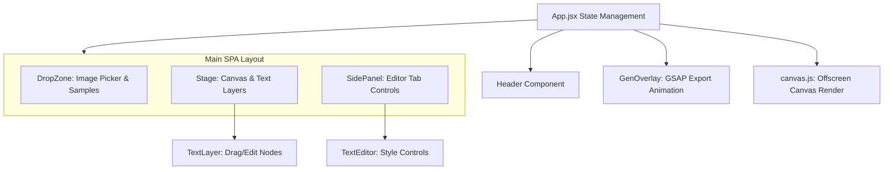

# kra-memes

MEMEFORGE is a sleek, highly interactive single-page web application for creating and customizing memes. It provides real-time canvas overlays, drag-and-drop file uploads, inline double-click editing, and an offscreen canvas rendering system that exports high-resolution memes. The UI implements a bold, colorful Neobrutalism design system that is fully responsive, dark-mode ready, and optimized for mobile devices.

**Stack:** React **19**, Vite **6**, GSAP **3**, Vitest **4**, Vanilla CSS.

---

## Prerequisites

- **Node.js 18+**
- **pnpm 8+**
- **Environment variables** — see [Configuration](#configuration).

---

## Quick Start

1. Install dependencies: `pnpm install`
2. Run the development server: `pnpm dev`
3. Access the app at `http://localhost:5173`

---

## Commands

| Action | Command |
|--------|---------|
| Install dependencies | `pnpm install` |
| Run dev server | `pnpm dev` |
| Build for production | `pnpm build` |
| Unit tests (watch) | `pnpm test` |
| Unit tests (run once) | `pnpm test:run` |
| Test UI | `pnpm test:ui` |
| Test coverage | `pnpm test:coverage` |

---

## Pages

| Path | Description | Access |
|------|-------------|--------|
| `/` | The main MemeForge SPA workspace where users upload images, add/edit text layers, customize styles, and download memes. | Public |

---

## Architecture



> Full system architecture (C4 Level 1, 2 & 3): [kra-docs-architecture](https://github.com/krealalejo/kra-docs-architecture)

**Structure:** The codebase follows a single-page app architecture centered around state in `App.jsx`. All mutable state (the loaded image, custom text layers, active selections, and loader status) is declared at the root of the tree and distributed to display components via props and change handlers. Drag-and-drop operations scale normalized coordinates (`0` to `1` range) relative to the image size, allowing resolution-independent rendering. When exporting, `canvas.js` uses an offscreen HTML5 `<canvas>` to draw the final PNG at high quality.

### Source layout

```
kra-memes/
├── index.html
├── package.json
├── pnpm-lock.yaml
├── README.md
├── vite.config.js
└── src/
    ├── main.jsx
    ├── App.jsx
    ├── App.test.jsx
    ├── index.css
    ├── constants.js
    ├── test-setup.js
    ├── components/
    │   ├── DropZone.jsx
    │   ├── GenOverlay.jsx
    │   ├── Header.jsx
    │   ├── Header.test.jsx
    │   ├── SidePanel.jsx
    │   ├── Stage.jsx
    │   ├── TextEditor.jsx
    │   └── TextLayer.jsx
    └── utils/
        ├── canvas.js
        ├── canvas.test.js
        ├── text.js
        └── text.test.js
```

---

## Configuration

| Variable | Purpose |
|----------|---------|
| *(None)* | No environment variables are currently required for this project. |

---

## Deployment

Managed by **Terraform** (`kra-infra`) and deployed via **GitHub Actions**. The pipeline automatically builds the production asset bundle and deploys it to the host environment.

> Run `kra-start` to start the EC2 instance before triggering a deploy pipeline run.
